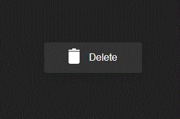
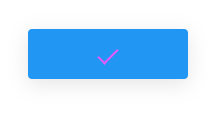

# Vg-Delete-Button
<p align="center">
  
</p>

This is a component delete button.

It doesn't have any logic internally, but it returns an event when clicked.

## Installation

```bash
npm install @vlalg-frontend-components/vg-delete-button

# or

yarn install @vlalg-frontend-components/vg-delete-button
```

## Usage
```js
// main.js
import { createApp } from 'vue'
import App from './App.vue'

import VgDeleteButton from '@vlalg-frontend-components/vg-delete-button'

const app = createApp(App)
app.use(TonhaoInputsThree)
app.mount('#app')
```

```jsx
// page.vue
<template>
  <VgDeleteButton />
</template>

<template>
  <vg-delete-button />
</template>

<template>
  <vg-delete-button></vg-delete-button>
</template>
```

## Props

| name    | Value type | Description |
| ------- | :--------- | :---------------------------- |
| text    | String | Define text button |
| activeBg | String | Define active background color (Hex or Color name) |
| activeColor | String | Define active text color (Hex or Color name) |

## Events

| name    | Return type | Description |
| ------- | :--------- | :---------------------------- |
| clicked | Boolean | Triggered when the button is clicked, it returns the status (false for inactive and true for active) |

## Example

<p align="left">
  
</p>
```jsx
// page.vue
<template>
  <VgDeleteButton
    text="Delete"
    activeBg="blue"
    activeColor="#E35BF9"
    @clicked="changeStatus"
  />
</template>

<script setup>
  const changeStatus = (value) => {
    console.log('clicked event: ', value)
  }

  return {
    changeStatus
  }
</script>
```
```bash
# console
clicked event: true
```

## License

[MIT](http://opensource.org/licenses/MIT)
